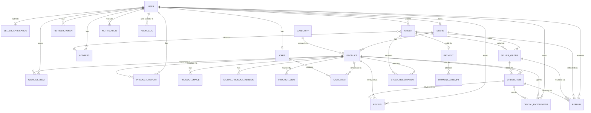

# Vendora Database Architecture

Schema source of truth: [`backend/prisma/schema.prisma`](../../backend/prisma/schema.prisma).
This document explains the design; the schema file is authoritative if the two
ever disagree.

## Entity-Relationship Diagram



*(Field lists are omitted from the diagram for readability — see the schema
file for exact columns, types, and defaults.)*

## Design Rationale By Area

### Users, roles, and seller status

`User.role` is only `USER` / `ADMIN` — it does **not** encode seller status.
Seller capability comes from having an approved `Store` (created once a
`SellerApplication` is approved), which is a separate 1:1 relation on `User`.
This directly supports the agreed flow:

```text
Everyone registers as USER (buyer)
        ↓
SellerApplication submitted (PENDING)
        ↓
Admin approves → Store created
        ↓
User can now sell AND still buy — role never changes
```

`SellerApplication` has a **unique `userId`**: resubmission after rejection
edits and re-submits the same row (status back to `PENDING`) rather than
creating a new one, per the agreed behavior.

### Authentication foundation

`RefreshToken` stores a **hash** of the token (`tokenHash`, unique), never the
raw value, plus `expiresAt`/`revokedAt` for expiry and revocation and
`replacedByTokenHash` to support rotation. No login/refresh logic is
implemented yet — this is schema only, per Phase 1 scope.

### Stores and suspension

`Store.status` (`ACTIVE` / `SUSPENDED` / `CLOSED`) governs public visibility.
Suspending a store never deletes anything — `Product`, `Order`, `SellerOrder`,
`Payment`, and `DigitalEntitlement` rows are untouched; the application layer
is responsible for hiding a suspended store's products from public listings.

### Products and lifecycle

`Product.status` implements the agreed lifecycle
(`DRAFT → PENDING_REVIEW → APPROVED/REJECTED → ARCHIVED`, with
`REJECTED → (edit) → PENDING_REVIEW` resubmission). `stockQuantity`,
`shippingType`, and `shippingFee` are nullable because they only apply to
`PHYSICAL` products — the database can't conditionally require a column based
on another column's value, so that rule (no shipping fields for `DIGITAL`
products) is enforced at the Zod/service layer, not via a DB constraint.

**Out-of-stock** is derived, not stored: `stockQuantity <= 0` means
out-of-stock. There's no separate `isAvailable` flag, since that would be a
redundant value that could drift out of sync with the real stock count.

### Digital products and versioning

`DigitalProductVersion` has one row per uploaded file version
(`@@unique([productId, version])`). There is no `isLatest` flag; "latest
version" is simply the row with `MAX(version)` for that product — resolved
with a query, not stored redundantly. `DigitalEntitlement` is keyed on
`(userId, productId)` (unique), not on a specific version, so a buyer's access
automatically follows whatever the latest version is when the seller uploads
a new one — no re-purchase and no new entitlement row needed.

### Cart and wishlist

One `Cart` per user (`Cart.userId` unique) holding items from any number of
stores — Vendora does not create a cart per seller. `CartItem` stores only
`quantity` plus timestamps; it does **not** snapshot price or product details,
since the cart is always revalidated live against the current `Product` at
checkout. `WishlistItem` is a simple join row with
`@@unique([userId, productId])` to prevent duplicates.

### Multi-vendor orders

This is the most important structural decision in the schema:

```text
Order (buyer's whole checkout)
  ├── SellerOrder (Store A's portion — own status, own shipping fee)
  │     └── OrderItem, OrderItem, ...
  └── SellerOrder (Store B's portion — own status, own shipping fee)
        └── OrderItem, ...
```

One `Order` row always represents one checkout, no matter how many sellers
are involved — verified directly in Phase 1 testing (see the Phase 1 report).
`SellerOrder` carries its own `status`, `subtotal`, and `shippingFee`, so one
seller can mark their portion `SHIPPED` while another is still `PROCESSING`.

`Order.status` uses a **separate, coarser enum** from `SellerOrder.status`
specifically to represent that mixed state at the aggregate level:

| `Order.status` | `SellerOrder.status` |
| --- | --- |
| `PENDING_PAYMENT` | `PENDING` |
| `PAID` | `PENDING` / `PROCESSING` |
| `PARTIALLY_PROCESSING` | mixed `PROCESSING`/other |
| `PARTIALLY_SHIPPED` | mixed `SHIPPED`/other |
| `PARTIALLY_DELIVERED` | mixed `DELIVERED`/other |
| `COMPLETED` | all `DELIVERED` |
| `CANCELLED` | all `CANCELLED` |

Keeping the parent `Order` in sync with its children's statuses is
application/service logic for a later phase — the schema only provides the
structure for it.

### Historical integrity (order item snapshots)

`OrderItem` duplicates everything a receipt needs to stay accurate forever:
`productNameSnapshot`, `priceSnapshot`, `productTypeSnapshot`,
`shippingFeeSnapshot`, `storeNameSnapshot`. `productId` is kept as a live FK
for traceability (e.g. "view this product now"), but nothing about the
historical order is ever read from the live `Product` row. **Verified in
Phase 1 testing**: updating `Product.price` and `Product.name` after the fact
does not change an existing `OrderItem`'s snapshot values.

### Stock reservations

`StockReservation` (`ACTIVE` / `CONFIRMED` / `RELEASED` / `EXPIRED`,
`quantity`, `expiresAt`) exists so a future checkout flow can reserve stock
before payment completes, preventing two buyers from overselling the same
limited-stock item. `orderId` is nullable because a reservation can be created
the moment checkout starts, before an `Order` row necessarily exists.
Reservation *logic* (expiring reservations, releasing on cancellation) is not
implemented yet — this phase only adds the structure.

### Payments (provider-agnostic)

`Payment` (one per `Order`) represents the current settled state;
`PaymentAttempt` (many per `Payment`) logs every attempt, including failures,
so a failed retry never overwrites what actually happened. `provider` is a
plain string, not an enum, specifically so a new payment provider can be
introduced later with a data change, not a schema migration.
`providerReference` is unique and kept separate from Vendora's own
`Payment.id` so it can be reconciled against the provider's dashboard.

### Refunds

A `Refund` can point at an `Order`, a `SellerOrder`, or an `OrderItem`
(all optional FKs) — exactly which one is set is an application-level rule,
not a database constraint, since a multi-vendor order is not always refunded
as a whole.

### Digital entitlements

Modeled as `User + Product + OrderItem → access`, unique on
`(userId, productId)`. See "Digital products and versioning" above for why
there's no per-version entitlement.

### Reviews

`Review.orderItemId` is unique — one review per qualifying purchase line item,
which is also how the database (indirectly) enforces "only verified buyers
can review": a review must reference a real `OrderItem` that belongs to that
user's order.

### Product reports

"One **active** report per user per product" is enforced with a **partial
unique index** added by hand in
`prisma/migrations/20260728093232_product_report_partial_unique/migration.sql`:

```sql
CREATE UNIQUE INDEX "ProductReport_reporterId_productId_active_unique"
ON "ProductReport" ("reporterId", "productId")
WHERE "status" = 'PENDING';
```

Prisma's schema syntax (`@@unique`) can't express a `WHERE`-conditional unique
constraint, so this one index is maintained directly in SQL rather than
`schema.prisma`. It was verified in Phase 1 testing: a second `PENDING` report
from the same user on the same product is rejected by the database, while a
resolved/dismissed report doesn't block a future new one.

### Notifications & audit logs

`Notification` is a plain per-user inbox row (`type`, `title`, `message`,
`isRead`, optional `relatedEntityType`/`relatedEntityId`) — no delivery
service implemented yet. `AuditLog.actorId` is nullable with `onDelete:
SetNull` specifically so the audit trail survives even if the admin account
that performed the action is later removed — audit history should never
disappear because of an unrelated account change.

## Deletion / Archival Strategy

Nothing that participates in a historical transaction is ever hard-deleted by
this schema's design — status fields (`ProductStatus`, `StoreStatus`,
`OrderStatus`, etc.) are the mechanism for "this is no longer active/visible."
`onDelete` behavior was chosen deliberately per relation, not left at Prisma's
default:

| Relation | onDelete | Why |
| --- | --- | --- |
| `Order.buyerId → User` | `Restrict` | A user with any order history can never be deleted. |
| `Order.shippingAddressId → Address` | `Restrict` | An address referenced by a historical order can't be removed. |
| `Product.storeId → Store` / `Product → OrderItem` | `Restrict` | A product that has ever been ordered can't be deleted. |
| `OrderItem.productId → Product` | `Restrict` | Same reasoning from the other side. |
| `Product → DigitalEntitlement`, `Product → Review` | `Restrict` | Buyer access and historical reviews must survive. |
| `SellerApplication.userId → User`, `Store.sellerId → User` | `Restrict` | Verification/business history is preserved. |
| `DigitalEntitlement.userId/productId/orderItemId → *` | `Restrict` | Access rights are never silently revoked by an unrelated delete. |
| `Review.userId/productId → User/Product` | `Restrict` | Historical feedback is preserved. |
| `Refund.requestedById → User` | `Restrict` | Financial request history is preserved. |
| `*.reviewedById` / `*.resolvedById` (admin reviewer FKs) | `SetNull` | The application/product/report/refund record survives even if the reviewing admin account is later removed — only "who reviewed it" is lost. |
| `AuditLog.actorId → User` | `SetNull` | The audit trail must outlive the actor's account. |
| `Order → SellerOrder`, `SellerOrder → OrderItem`, `Payment → PaymentAttempt`, `Order → Payment` | `Cascade` | These are structural children with no independent meaning apart from their parent — deleting the (never-deleted-in-practice) parent should take them with it. |
| `Cart → CartItem`, `User → Cart/Address/RefreshToken/WishlistItem/Notification` | `Cascade` | Ephemeral, non-financial, non-historical data. |
| `Product → ProductImage/DigitalProductVersion/ProductView/CartItem/WishlistItem` | `Cascade` | Metadata/ephemeral data with no independent historical value. |

## Indexes

Indexes were added to support real, anticipated query patterns — not blindly
on every column:

- `Product`: `status`, `categoryId`, `storeId` (browse/filter queries), plus
  the unique `slug`.
- `Order`: `buyerId` (a user's order history), `status`.
- `SellerOrder`: `orderId`, `storeId` (a seller's orders), `status`.
- `OrderItem`: `sellerOrderId`, `productId`.
- `Payment`: `status`; `providerReference` unique.
- `Notification`: `(userId, isRead)` (unread inbox), `(userId, createdAt)`
  (chronological inbox).
- `Review`: `productId` (a product's reviews).
- `ProductReport`: `status`, `(reporterId, productId)`.
- `AuditLog`: `(entityType, entityId)`, `actorId`, `createdAt`.
- `RefreshToken`: `userId`, `expiresAt` (cleanup queries).
- `StockReservation`: `(productId, status)`, `expiresAt` (expiry sweeps).

## Known Simplifications (deliberate, revisit later if needed)

- Product variants are explicitly out of scope for V1 (per the phase spec).
- Categories are flat — no parent/child hierarchy.
- `Order.shippingAddressId` is a single address for the whole checkout, even
  across multiple sellers — matches the "single checkout" requirement.
- Physical/digital-only field constraints (no shipping fields on digital
  products) are enforced at the validation layer, not the database.
- Refund scope (order vs. seller-order vs. item level) is an application rule,
  not a DB constraint — Prisma can't express "exactly one of these three FKs
  is set."
